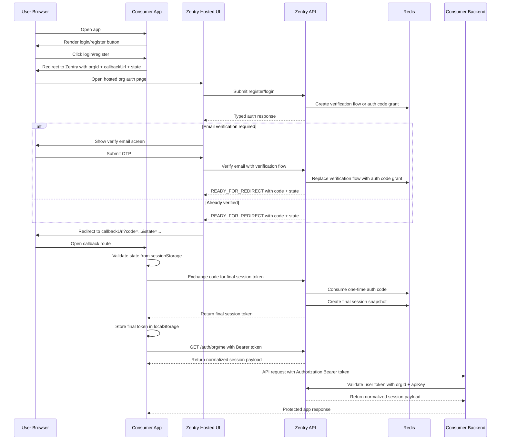

# `@zentry-org/sdk`

Zentry SDK for browser apps and backend APIs that integrate with Zentry organization authentication.

This package currently provides:

- `@zentry-org/sdk/react` for browser apps such as Vite + React, Next.js, and TanStack Start
- `@zentry-org/sdk/react-server` for server-side React helpers
- `@zentry-org/sdk/node` for backend APIs such as Express

All SDK layers use the same normalized session payload: `ZentrySessionType`.

## What This SDK Solves

Zentry separates:

- organization identity
- end-user identity

That means a valid authenticated request inside an organization must prove both:

- which organization/app is making the integration request
- which end-user is signed in inside that organization

Zentry is the hosted auth provider. Your app owns its UI state and API requests. The SDK helps with:

- redirecting users into the hosted org login/register flow
- processing the callback safely with `code + state`
- storing the final session token in `localStorage` for UI-only React apps
- fetching the normalized session payload
- forwarding the user token to your backend API
- validating that user token on the backend together with `orgId` and `apiKey`

## Current Organization Auth Flow

Zentry now uses a secure redirect handoff:

1. your app redirects the user to Zentry hosted org login/register
2. the SDK includes:
   - `orgId`
   - `callbackUrl`
   - a random `state`
3. the user authenticates in Zentry
4. if email verification is required, Zentry completes that step inside the hosted flow first
5. Zentry redirects back to your callback URL with:
   - `code`
   - `state`
6. the SDK verifies `state`
7. the SDK exchanges the short-lived `code` for the real session token
8. the SDK stores the final session token in `localStorage`
9. the SDK fetches the full session in `ZentrySessionType` shape

## Full Org Auth Flow



## Shared Session Shape

The React SDK and Node SDK both use the same session structure from [`src/zod.ts`](./src/zod.ts):

- `user`
- `org`
- `membership`
- `account`

Backend middleware attaches this payload to:

```ts
req.zentry
```

Type:

```ts
import type { ZentrySessionType } from '@zentry-org/sdk/react';
```

## Installation

```bash
pnpm add @zentry-org/sdk
```

Peer dependencies:

- `react` for the React SDK
- `express` for the Node SDK

## React SDK

Use the React SDK when your app has a browser UI and you want Zentry to handle hosted organization authentication.

The React SDK gives you:

- `ZentryProvider`
- `useZentry()`
- `useZentryCallbackSync()`
- `RegisterButton`
- `LoginButton`
- `LogoutButton`
- `Authenticated`
- `UnAuthenticated`

### Required frontend env

```env
ZENTRY_ORG_ID=your-org-id
ZENTRY_APP_CALLBACK_URL=http://localhost:3000/auth/callback
```

Notes:

- `ZENTRY_ORG_ID` identifies the organization/app context
- `ZENTRY_APP_CALLBACK_URL` must be registered in Zentry as an allowed callback URL
- this callback URL is where Zentry returns `code + state`

### What `ZentryProvider` does

`ZentryProvider` is responsible for:

- redirecting to the hosted org login/register pages
- generating and storing the temporary `state`
- syncing the current org session from Zentry
- exposing `session`, `isAuthenticated`, and `getSessionToken()`

### Built-in React components

These exports are unstyled components:

- `RegisterButton`
- `LoginButton`
- `LogoutButton`
- `Authenticated`
- `UnAuthenticated`

Example:

```tsx
import {
  Authenticated,
  LoginButton,
  LogoutButton,
  RegisterButton,
  UnAuthenticated,
} from '@zentry-org/sdk/react';

export function AuthActions() {
  return (
    <>
      <UnAuthenticated>
        <RegisterButton className="btn btn-secondary" />
        <LoginButton className="btn btn-primary" />
      </UnAuthenticated>

      <Authenticated>
        <LogoutButton className="btn btn-danger" label="Sign out" />
      </Authenticated>
    </>
  );
}
```

## React Setup By Framework

### Vite + React

Wrap your app:

```tsx
import { ZentryProvider } from '@zentry-org/sdk/react';

export function AppProviders({ children }: { children: React.ReactNode }) {
  return (
    <ZentryProvider
      env={{
        ZENTRY_ORG_ID: import.meta.env.VITE_ZENTRY_ORG_ID,
        ZENTRY_APP_CALLBACK_URL: `${window.location.origin}/auth/callback`,
      }}
    >
      {children}
    </ZentryProvider>
  );
}
```

Mount it in `src/main.tsx`:

```tsx
import { createRoot } from 'react-dom/client';
import { AppProviders } from './AppProviders';
import App from './App';
import './index.css';

createRoot(document.getElementById('root')!).render(
  <AppProviders>
    <App />
  </AppProviders>,
);
```

Create the callback page:

```tsx
import { useZentryCallbackSync } from '@zentry-org/sdk/react';

export default function AuthCallbackPage() {
  useZentryCallbackSync();
  return <div>Signing you in...</div>;
}
```

### TanStack Start

Mount `ZentryProvider` near the root shell:

```tsx
import * as React from 'react';
import { HeadContent, Scripts, createRootRouteWithContext } from '@tanstack/react-router';
import type { QueryClient } from '@tanstack/react-query';
import { ZentryProvider } from '@zentry-org/sdk/react';

interface MyRouterContext {
  queryClient: QueryClient;
}

export const Route = createRootRouteWithContext<MyRouterContext>()({
  shellComponent: RootDocument,
});

function RootDocument({ children }: { children: React.ReactNode }) {
  return (
    <html lang="en">
      <head>
        <HeadContent />
      </head>
      <body>
        <ZentryProvider
          env={{
            ZENTRY_ORG_ID: import.meta.env.VITE_ZENTRY_ORG_ID,
            ZENTRY_APP_CALLBACK_URL: `${window.location.origin}/auth/callback`,
          }}
        >
          {children}
        </ZentryProvider>
        <Scripts />
      </body>
    </html>
  );
}
```

Callback route example:

```tsx
import { createFileRoute } from '@tanstack/react-router';
import { useZentryCallbackSync } from '@zentry-org/sdk/react';

export const Route = createFileRoute('/auth/callback')({
  component: AuthCallbackPage,
});

function AuthCallbackPage() {
  useZentryCallbackSync();
  return <div>Signing you in...</div>;
}
```

Server-side session lookup example:

```ts
import { createServerFn } from '@tanstack/react-start';
import { getServerSession } from '@zentry-org/sdk/react-server';

export const getCurrentSession = createServerFn({ method: 'POST' })
  .validator((token: string) => token)
  .handler(async ({ data }) => {
    return getServerSession({
      env: {
        ZENTRY_ORG_ID: process.env.ZENTRY_ORG_ID!,
      },
      token: data,
    });
  });
```

### Next.js

Create a client provider:

```tsx
'use client';

import type { ReactNode } from 'react';
import { ZentryProvider } from '@zentry-org/sdk/react';

export function Providers({ children }: { children: ReactNode }) {
  return (
    <ZentryProvider
      env={{
        ZENTRY_ORG_ID: process.env.NEXT_PUBLIC_ZENTRY_ORG_ID!,
        ZENTRY_APP_CALLBACK_URL: `${process.env.NEXT_PUBLIC_APP_URL!}/auth/callback`,
      }}
    >
      {children}
    </ZentryProvider>
  );
}
```

Mount it in `app/layout.tsx`:

```tsx
import type { ReactNode } from 'react';
import { Providers } from './providers';

export default function RootLayout({ children }: { children: ReactNode }) {
  return (
    <html lang="en">
      <body>
        <Providers>{children}</Providers>
      </body>
    </html>
  );
}
```

Callback page example:

```tsx
'use client';

import { useZentryCallbackSync } from '@zentry-org/sdk/react';

export default function AuthCallbackPage() {
  useZentryCallbackSync();
  return <div>Signing you in...</div>;
}
```

Server component session lookup example:

```tsx
import { cookies } from 'next/headers';
import { getServerSession } from '@zentry-org/sdk/react-server';

export default async function DashboardPage() {
  const cookieStore = await cookies();

  const session = await getServerSession({
    env: {
      ZENTRY_ORG_ID: process.env.NEXT_PUBLIC_ZENTRY_ORG_ID!,
    },
    cookie: cookieStore.toString(),
  });

  if (!session) {
    return <div>No session found</div>;
  }

  return <div>Welcome {session.user.firstName}</div>;
}
```

## Callback Route Behavior

`useZentryCallbackSync()` should be used only on your callback page.

What it does:

1. reads `code` and `state` from the URL
2. validates the returned `state` against the pending state stored before redirect
3. exchanges `code` for the final session token
4. stores that final token in `localStorage`
5. removes temporary query params from the URL
6. reloads so normal session sync can run

This is why your callback page can stay very small:

```tsx
import { useZentryCallbackSync } from '@zentry-org/sdk/react';

export default function AuthCallbackPage() {
  useZentryCallbackSync();
  return <div>Signing you in...</div>;
}
```

## Read Auth State In React

```tsx
import { LogoutButton, useZentry } from '@zentry-org/sdk/react';

export function Profile() {
  const { session, isAuthenticated, isLoading } = useZentry();

  if (isLoading) return <div>Loading...</div>;

  if (!isAuthenticated) {
    return <p>You are not logged in.</p>;
  }

  return (
    <div>
      <p>User ID: {session?.user.id}</p>
      <p>Org ID: {session?.org.id}</p>
      <p>Role: {session?.membership.role}</p>
      <LogoutButton label="Sign out" />
    </div>
  );
}
```

## Forward The User Token To Your Backend

When your frontend calls your own backend API, forward the Zentry user token:

```tsx
import axios from 'axios';
import { useZentry } from '@zentry-org/sdk/react';

export function ExampleButton() {
  const { getSessionToken } = useZentry();

  async function handleClick() {
    const token = getSessionToken();
    if (!token) return;

    await axios.get('/api/me', {
      headers: {
        Authorization: `Bearer ${token}`,
      },
    });
  }

  return <button onClick={handleClick}>Call API</button>;
}
```

If you prefer a shared HTTP client, attach the token in one place:

```ts
import axios from 'axios';

export const api = axios.create({
  baseURL: '/api',
  headers: {
    'Content-Type': 'application/json',
  },
});

export function attachUserToken(token: string | null) {
  if (!token) {
    delete api.defaults.headers.common.Authorization;
    return;
  }

  api.defaults.headers.common.Authorization = `Bearer ${token}`;
}
```

## React Server Session Helper

Use `@zentry-org/sdk/react-server` in server-side React code when you need to validate a forwarded token or incoming cookie against Zentry.

Import:

```ts
import { getServerSession } from '@zentry-org/sdk/react-server';
```

Example:

```ts
import { getServerSession } from '@zentry-org/sdk/react-server';

export async function loadSession(token: string) {
  return getServerSession({
    env: {
      ZENTRY_ORG_ID: process.env.ZENTRY_ORG_ID!,
    },
    token,
  });
}
```

## Node / Express SDK

Use the Node SDK in your backend API to validate the forwarded user token with Zentry.

### Required backend env

```env
ZENTRY_ORG_ID=your-org-id
ZENTRY_API_KEY=your-org-api-key
```

Notes:

- `ZENTRY_ORG_ID` identifies the organization
- `ZENTRY_API_KEY` is the raw secret API key generated for that organization
- the backend SDK sends both the raw API key and the user token to Zentry for verification

### Create the client

```ts
import { ZentryClient } from '@zentry-org/sdk/node';

export const zentry = new ZentryClient({
  orgId: process.env.ZENTRY_ORG_ID!,
  apiKey: process.env.ZENTRY_API_KEY!,
});
```

### Protect routes with `requireUser()`

`requireUser()`:

- reads the incoming bearer token from your backend request
- calls Zentry `/auth/org/me`
- sends:
   - `Authorization: Bearer <user_token>`
   - `X-Zentry-Org-ID`
   - `X-Zentry-API-Key`
- validates the returned session shape
- attaches the normalized session to `req.zentry`

```ts
import express from 'express';
import { zentry } from './zentry';

const app = express();

app.get('/api/me', zentry.requireUser(), (req, res) => {
  res.json({
    session: req.zentry,
    userId: req.zentry?.user.id,
    orgId: req.zentry?.org.id,
    role: req.zentry?.membership.role,
  });
});
```

### Use `requireOrg()`

`requireOrg()` is a lightweight middleware that confirms the SDK instance was created with org credentials.

```ts
app.use(zentry.requireOrg());
```

It does not perform a remote validation request by itself.

## End-To-End Integration Summary

### Browser flow

1. `ZentryProvider` renders in your app
2. the user clicks `login()` or `register()`
3. the SDK redirects to the hosted Zentry org auth UI
4. Zentry authenticates the user and completes email verification if needed
5. Zentry redirects back with `code + state`
6. `useZentryCallbackSync()` validates state and exchanges the code
7. the final token is stored in `localStorage`
8. the provider loads the normalized session payload

### Backend flow

1. the frontend sends `Authorization: Bearer <token>` to your backend
2. your backend uses `zentry.requireUser()`
3. the Node SDK calls Zentry with:
   - the user token
   - the org ID
   - the org API key
4. Zentry validates:
   - org identity
   - org API key
   - user session token
   - org membership
5. Zentry returns the normalized session payload
6. the SDK attaches the payload to `req.zentry`

## Internal Headers

The SDK uses these headers internally:

- `X-Zentry-Org-ID`
- `X-Zentry-API-Key`

Frontend apps usually send:

- `X-Zentry-Org-ID`

Backend apps send:

- `Authorization: Bearer <user_token>`
- `X-Zentry-Org-ID`
- `X-Zentry-API-Key`

## Security Notes

- The callback URL only receives a short-lived one-time code and a `state`.
- The React SDK validates `state` before exchanging the code.
- The Node SDK validates the user token in the context of both the org ID and the org API key.
- For UI-only React apps, the final session token is stored in `localStorage`.

## Summary

Use:

- `@zentry-org/sdk/react` in the browser UI
- `@zentry-org/sdk/react-server` for server-side React helpers
- `@zentry-org/sdk/node` in your backend API

The browser SDK owns:

- redirecting into hosted auth
- callback code exchange
- storing the final token
- loading the normalized session

The backend SDK owns:

- validating the forwarded user token against Zentry
- verifying org identity with `orgId + apiKey`
- attaching the normalized session to `req.zentry`

Both layers stay aligned through the shared `ZentrySessionType`.
